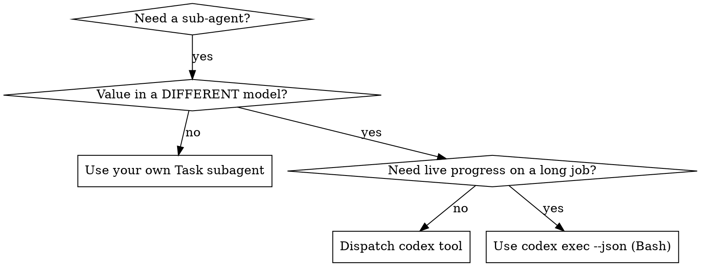

# Dispatching GPT via Codex MCP

## Overview

You dispatch a task to GPT running as a Codex agent. It has its own sandbox and blank context — it sees nothing of your session, so you construct exactly what it needs. The value is that it is a *different model*: second opinion, adversarial review, or a parallel executor.

**Core principle:** One `codex` call = one independent GPT agentic turn. Reuse the `threadId` to continue; review its diffs before trusting them.

**Prerequisite — set it up on first use.** This skill needs the tools `mcp__gpt-codex__codex` and `mcp__gpt-codex__codex-reply`. If they're absent, provision them now, then tell the user to restart Claude Code (MCP tools only load at startup):

1. **Codex CLI + auth** — run `codex login status`. If Codex isn't installed or isn't logged in, tell the user to run `npm i -g @openai/codex && codex login` (interactive browser auth — only they can complete it).
2. **Register the server yourself** (user-level):
   - macOS/Linux: `claude mcp add gpt-codex -s user -- codex mcp-server -c sandbox_mode=workspace-write -c approval_policy=never`
   - Windows (run from PowerShell, or prefix `MSYS_NO_PATHCONV=1` in Git Bash — else `/c` mangles to `C:/`): `claude mcp add gpt-codex -s user -- cmd /c codex mcp-server -c sandbox_mode=workspace-write -c approval_policy=never`
   - Equivalent: copy the bundled [references/mcp.json](references/mcp.json) (macOS/Linux) or [references/mcp.windows.json](references/mcp.windows.json) (Windows) into the project root as `.mcp.json`.
3. Tell the user: **server registered — restart Claude Code, then ask again.** Verify with `claude mcp list` → `gpt-codex: connected`.

## When to Use



**Use when:**
- You want a second-model perspective or adversarial review of your own changes
- A bounded task can run autonomously (implement a module, run an experiment, fix a scoped bug)
- Cross-checking a result against a different model matters

**Don't use when:**
- The task needs your live session context — GPT starts blank
- You need streaming/live progress → `codex exec --json` via Bash instead
- It's trivial and you can answer it yourself — a GPT turn is slow and costs subscription quota
- GPT would edit the same files you're editing → conflicts

## The Pattern

### 1. Scope one self-contained task
GPT sees none of your context. Give it everything: goal, relevant file paths, constraints, and what to return.

### 2. Dispatch via the `codex` tool
Always pass:
- `prompt` — the full task, self-contained
- `cwd` — the project dir (relative paths resolve to the server's cwd, not yours)
- `sandbox` — `read-only` for review, `workspace-write` to let it edit/run
- `model` — override if you want a specific GPT model

Capture `threadId` from the returned `structuredContent`.

### 3. Continue via `codex-reply`
Follow-ups reuse `threadId` so GPT keeps context. A fresh `codex` call = a blank agent.

### 4. Review and integrate
Read `content`, inspect any diffs GPT made, run tests. Never merge GPT's edits blind.

## Dispatch Prompt Structure

Self-contained, specific, states the output:

```markdown
Task: Fix the failing test in the date-range parser.

Context:
- File: src/parsers/date_range.py, function `parse_range` (lines ~40-90)
- Bug: when the end date equals the start date, it returns an empty range instead of a single-day range; see failing test tests/test_date_range.py::test_single_day
- Constraint: do NOT change the public signature of `parse_range`; leave timezone handling untouched

Do:
1. Read the file and the failing test
2. Find the root cause of the off-by-one
3. Fix it; run `pytest tests/test_date_range.py -k single_day`

Return: root cause in one sentence + the diff you applied + test result.
```

## Quick Reference

| `codex` param | Values / use |
|---|---|
| `prompt` | Required. Full self-contained task. |
| `cwd` | Project dir. Always set it. |
| `sandbox` | `read-only` / `workspace-write` / `danger-full-access` (default via config) |
| `approval-policy` | `never` for autonomous (you drive, no human to approve) |
| `model` | e.g. `gpt-5.x`, `o3` — override default |
| `base-instructions` | Replace GPT's system prompt if needed |

`codex-reply`: `prompt` + `threadId` (required) to continue a session.

## Common Mistakes

**❌ Assuming GPT sees the chat:** "fix the bug we discussed" — it has no context
**✅ Self-contained:** paste paths, errors, constraints

**❌ Omitting `cwd`:** relative paths resolve to server cwd, GPT edits the wrong tree
**✅ Pass `cwd`** = project dir

**❌ New `codex` call for a follow-up:** loses the thread, GPT restarts blank
**✅ `codex-reply` with the `threadId`**

**❌ Trusting edits blind:** GPT edited autonomously under `workspace-write`
**✅ Review the diff**, run tests before integrating

**❌ `danger-full-access` by default:** unbounded
**✅ `workspace-write`** to edit, `read-only` to review

## Verification

After GPT returns:
1. Read its summary — does the root cause make sense?
2. `git diff` its changes — scoped as instructed?
3. Run the tests it claims pass
4. `claude mcp list` shows `gpt-codex: connected` if a call fails to route
