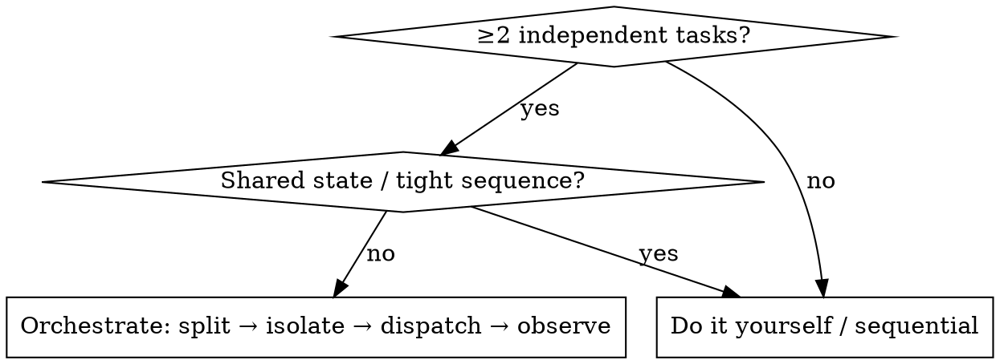

# Orchestrating Parallel Research

## Overview

You run a fleet of agents as the **coordinator (军师), not a worker**. Your leverage is deciding *what to split, how to isolate, what to hand each agent, and how to synthesize* — never doing the grunt work yourself.

**Core principle:** front-load the standardization (directories, isolation, dispatch contract) so N agents run at once without colliding — then observe and adjust. It is a standing engineering setup decided **up front**, NOT mid-flight patching. Don't fix agent-1's layout at minute 10 then agent-2's at minute 20 — you predicted the situations and standardized before the first launch.

## When to Use

**Two modes** — pick per project:
- **(A) Local software dev (most common)** — agents modify/build a software project locally; isolate via git branch/worktree.
- **(B) Research experiments** — remote GPU, many agents, parallel runs (implement / tune / ablate / main run / summarize); isolate via full-folder checkout. You read papers → define innovation points → hand each an outline/pseudocode.

**Don't** orchestrate a single task, tightly-coupled sequential steps, or anything trivial — do it yourself.

## The four coordinator moves

1. **Split on isolation boundaries** — cut the work so no two agents touch the same files (one module / package / innovation point each). Getting the cut right up front is what prevents merge pain later.
2. **Isolate physically** — each agent gets its **own full workspace** (fresh checkout of the main branch) + own branch + own artifact dir, **local and remote**. Edits and outputs can't cross-contaminate. Merge-back is optional. → [references/isolation-and-dirs.md](references/isolation-and-dirs.md)
3. **Dispatch direction, not a cage** — hand each agent clear **input / output / goal + an outline or pseudocode**, then let it implement. Do NOT script every step or pile on "don't do X"; let it think. → [references/dispatch.md](references/dispatch.md)
4. **Observe & adjust** — read each report, evaluate against the goal, re-plan the next wave. Whether an agent complied or produced something different is *your* signal to steer. Dynamic scheduling, not fire-and-forget.

## Standardize before you launch

| Pillar | Rule | Detail |
|---|---|---|
| Directory | Trunk fixed forever; each new point = a new subfolder, never edit the trunk | [isolation-and-dirs.md](references/isolation-and-dirs.md) |
| Isolation | One full workspace per agent, local + remote, no cross-pollution | ↑ same |
| Remote GPU / SSH | One serial SSH channel; thin files back, heavy artifacts stay; deploy + gate checklist | [remote-gpu-ssh.md](references/remote-gpu-ssh.md) |
| Dispatch | Direction + pseudocode; agents self-test; you don't hand-test | [dispatch.md](references/dispatch.md) |
| Reporting | Readability first: effect/analysis not code, tables + one-line takeaway, split if >~4000 chars | [reporting.md](references/reporting.md) |

## Common Mistakes

**❌ Micromanaging** the agent step-by-step → **✅** give goal + pseudocode, let it implement.
**❌ Mid-flight standardizing** (patch each agent's layout as you go) → **✅** fix dirs/isolation/contract before the first launch.
**❌ Shared workspace** so agents clobber each other → **✅** one full workspace each, local + remote.
**❌ Doing the work yourself** "because it's faster" → **✅** you're the brain: split, dispatch, synthesize.
**❌ Fat reports** full of function/variable names → **✅** effect + analysis, tables, one-line conclusions.
**❌ Param grids / tuning on the shared GPU** → **✅** GPU only for first-run / one-off collection / final adjudication; grids go offline.

## Verification (you, deterministically)

Agent output must be checkable **without trusting its self-score**: diff its changes, re-run its claimed test, or run a deterministic check script. Also confirm (a) your project's own correctness contract still holds (whatever you defined — output-equivalence, quality parity, a golden result) and (b) the code path you switched on actually executed (**instrument a counter, count > 0**) — "it ran and matched" is meaningless if the new path never ran.
